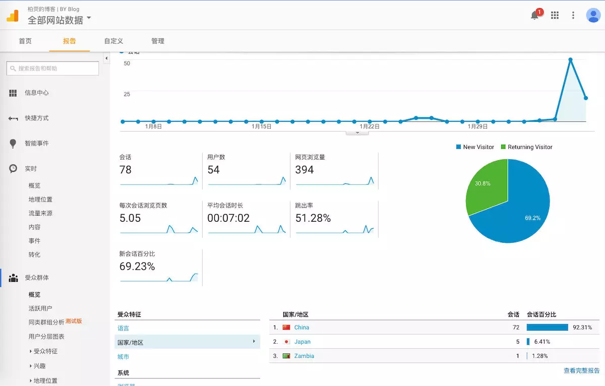

参考

[利用 GitHub Pages 快速搭建个人博客](https://www.jianshu.com/p/e68fba58f75c)

[如何利用github打造博客专属域名](https://blog.csdn.net/lmj623565791/article/details/51319147)

[为博客添加 Gitalk 评论插件](https://zhuanlan.zhihu.com/p/81270400)


## 搭建博客

#### github打造博客专属域名

##### 一、为什么是github

​		博客站点是csdn所提供的，归属于csdn的blog子域名下，如果你`ping csdn博客地址`最终得到的ip可能是csdn某台服务器的，甚至是拿不到的。希望有一个好记的域名，但是在设置域名解析的时候只能填写ip，所以csdn的ip是不行的，不过如果你是自己搭建的服务器站点就可以简单设置解析ip就可以了。

​		`github pages`算github提供的一个服务，我们可以免费的在其上面搭建自己的网站，也有很多人利用github pages作为自己的个人博客站点。

##### 二、Github Pages的使用

（1）新建仓库

​		首先你需要一个github的账号，立志作为一名优秀的程序员，这个账号是应该有的，如果没有赶快申请一个。有了账号以后，首先点击新建仓库，如图：


然后到达仓库信息填写界面，如图：


​		这里只要注意一个地方，就是仓库的名称，必须是：`你的用户名.github.io`，例如我的用户名是lwm78760，我填写的仓库名称即为：`lwm78760.github.io`，爆红是因为我已经创建过。

（2）更新内容
		有了仓库以后，你就可以去随意的更新内容了，如果你对html熟悉，你可以随便写个页面提交上去，比如我写个简单的html页面。

先简单说一下如果更新github仓库中的内容：

1. clone到本地

   命令行进入硬盘上要下载地方的文件夹，然后执行

```bash
git clone https://github.com/lwm78760/lwm78760.github.io.git
```

​		注意修改为你的仓库地址，如果你的电脑上并不支持git命令，你可以先[安装好git并配置好环境](https://lwm78760.github.io/2020/03/14/Git安装与使用/)。

​		到达本地之后，我们就可以准备好需要更新进去的页面了，比如我新建一个index.html内容如下：

```html
<!DOCTYPE html>
<html>
<body>
<h1>这是我使用github pages搭建的个人站点。</h1>
</body>
</html>
```

​		完成之后，记得保存，index.html必须和你clone下来的`.git`文件夹在同一个目录，如图：


​		完成之后，就是提交了。

```bash
cd lwm78760.github.io
git add .
git commit -m "更新index.html，编写博文测试"
git push
# 后面可能要输入用户名密码
```

​		注意首先命令行进入你的lwm78760.github.io这个目录，然后依次执行git add . , git commit -m "注释"，git push，然后输入你的用户名，密码即可。

​		更新成功之后，你的个人站点搭建成功了。默认的地址是:

```bash
http://lwm78760.github.io
lwm78760替换为你的github名字
```

​		如果你想利用这个做个人博客，就可以跳过这个，进入[github搭建博客](#github  frok别人博客快速搭建)。

##### 三、打造博客专属域名

（1）IP地址

你可以先ping你的github  的url获得IP

```bash
ping www.lwm78760.github.io
```

然后拿到返回的这个IP地址

（2）域名购买与解析

​		首先你要有个域名，那么就要去申请域名了，这里我们可以通过万网申请：https://wanwang.aliyun.com/，查找你想申请域名，如果可以买，购买就可以了，购买根据提示填写就可以。

​		进入阿里云的管理控制台，找到你已经购买的域名，点击解析，


​		点击新手引导，输入IP地址是最快的，


​		同时如果想要自己配置，点击添加记录，只修改主机记录与记录值，记录值填写IP，

- 主机记录`www`对应`www.lwm78760.com`
- 主机记录`@`对应lwm78760.com`


（3）CNAME

​		此时是不能直接访问域名跳转到我们刚才的github页面，差一个CNAME文件，这个文件需要提交到我们刚才创建的仓库，内容为我们的域名，例如:


​		内容为`www.lwm78760.com`

​		然后记得执行：`git add .` , `git commit -m "注释"`，`git push`，然后输入你的用户名，密码即可，就可以通过你的域名访问了。

​		到这里你已经学会了如何通过你购买的域名与github pages结合，即通过你购买的域名访问你的个人站点了。

（4）神奇的JS，平台跳转

​		可以这么写`index.html`，加一行js跳转代码：

```html
<!DOCTYPE html>
<html>
<script>
    window.location.href="所要跳转的页面";
</script>

<body>
</body>

</html>
```

​		就可以通过`lwm78760.com`直接跳转到任意页面了。

​		but，心细的人并没有满足，比如我们手机访问的csdn列表页面和电脑的列表页面不同的，于是我们可以更加完善我们的js代码：

```html
<script>
function browserRedirect() {
    var sUserAgent = navigator.userAgent.toLowerCase();
    var bIsIpad = sUserAgent.match(/ipad/i) == "ipad";
    var bIsIphoneOs = sUserAgent.match(/iphone os/i) == "iphone os";
    var bIsMidp = sUserAgent.match(/midp/i) == "midp";
    var bIsUc7 = sUserAgent.match(/rv:1.2.3.4/i) == "rv:1.2.3.4";
    var bIsUc = sUserAgent.match(/ucweb/i) == "ucweb";
    var bIsAndroid = sUserAgent.match(/android/i) == "android";
    var bIsCE = sUserAgent.match(/windows ce/i) == "windows ce";
    var bIsWM = sUserAgent.match(/windows mobile/i) == "windows mobile";
    if (!(bIsIpad || bIsIphoneOs || bIsMidp || bIsUc7 || bIsUc || bIsAndroid || bIsCE || bIsWM) ){
        window.location.href="电脑页面";
    } else {
        window.location.href="手机页面";
    }
}
browserRedirect();
</script>

```

​		通过判断userAgent来确定是否是来自手机端的，如果是手机端的访问mobile的页面，否则访问pc端页面。

#### github  frok别人博客快速搭建

##### 一、拉取博客模板

​		找到github上你喜欢的博客模板，点击右上角的 **Fork** 将仓库拉倒你的账号下。

​		我是使用  [柏荧的博客 | BY Blog](https://links.jianshu.com/go?to=http%3A%2F%2Fqiubaiying.vip)  搭建的，是使用 [GitHub Pages](https://links.jianshu.com/go?to=https%3A%2F%2Fpages.github.com%2F) + [jekyll](https://links.jianshu.com/go?to=http%3A%2F%2Fjekyll.com.cn%2F) 的方式。

​		搜索 `qiubaiying.github.io` 进入[仓库](https://links.jianshu.com/go?to=https%3A%2F%2Fgithub.com%2Fqiubaiying%2Fqiubaiying.github.io)


​		点击右上角的 **Fork** 后稍等一下，点击刷新，你会看到**Fork**了成功的页面

==修改仓库名==

​		点击**settings**进入设置


​		修改仓库名为 `你的Github账号名.github.io`，然后 Rename，如果仓库名已经存在，需要[删除](#删除操作)。


​		这时你在在浏览器中输入 `你的Github账号名.github.io` 例如:`baiyingqiu.github.io`，你将会看到如下界面：

		说明已经成功一半了😀。。。当然，还需要修改博客的配置才能变成你的博客。

​		若是出现


​		则需要检查一下你的仓库名是否正确,可以将原仓库名lwm78760.github.io修改成lwm78760.github.com，等个几秒钟强刷https://lwm78760.github.io/地址，就能看到网站正常显示。

​		有一个小tips 建议一下， 当fork之后， 修改setting文件，访问自己的网站报404 时，建议修改一下CNAME 文件，commit 一下，然后回到repository 刷新一下就可以访问了。详细参照：[https://github.com/prose/prose/issues/703](https://links.jianshu.com/go?to=https%3A%2F%2Fgithub.com%2Fprose%2Fprose%2Fissues%2F703)

##### 二、整个网站结构

​		修改Blog前我们来看看Jekyll 网站的基础结构，当然我们的网站比这个复杂。

```ruby
├── _config.yml
├── _drafts
|   ├── begin-with-the-crazy-ideas.textile
|   └── on-simplicity-in-technology.markdown
├── _includes
|   ├── footer.html
|   └── header.html
├── _layouts
|   ├── default.html
|   └── post.html
├── _posts
|   ├── 2007-10-29-why-every-programmer-should-play-nethack.textile
|   └── 2009-04-26-barcamp-boston-4-roundup.textile
├── _data
|   └── members.yml
├── _site
├── img
└── index.html
```

​		很复杂看不懂是不是，不要紧，你只要记住其中几个OK了

- `_config.yml` 全局配置文件

- `_posts` 放置博客文章的文件夹

- `img` 存放图片的文件夹

  ​	其他的想继续深究可以[看这里](https://links.jianshu.com/go?to=http%3A%2F%2Fjekyll.com.cn%2Fdocs%2Fstructure%2F)

##### 三、修改博客配置

​		来到你的仓库，找到`_config.yml`文件,这是网站的全局配置文件。


​		点击修改


​		然后编辑`_config.yml`的内容

​		接下来我们来详细说说以下配置文件的内容：

==基础设置==

```bash
# Site settings
title: You Blog                     #你博客的标题
SEOTitle: 你的博客 | You Blog        #显示在浏览器上搜索的时候显示的标题
header-img: img/post-bg-rwd.jpg     #显示在首页的背景图片
email: You@gmail.com    
description: "You Blog"              #网站介绍
keyword: "You, You Blog, 你的博客, 你, iOS, Apple, iPhone" #关键词
url: "https://你.github.io"          # 这个就是填写你的博客地址
baseurl: ""      # 这个我们不用填写
```

==侧边栏==

```csharp
# Sidebar settings
sidebar: true                           # 是否开启侧边栏.
sidebar-about-description: "说点装逼的话。。。"
sidebar-avatar:/img/about-BY-gentle.jpg      # 你的个人头像 这里你可以改成我在img文件夹中的两张备用照片 img/avatar-m 或 avatar-g
```

==社交账号==

​		展示你的其他社交平台


​		在下面你的社交账号的用户名就可以了，若没有可不用填

```bash
# SNS settings
RSS: false
weibo_username:     username
zhihu_username:     username
github_username:    username
facebook_username:  username
jianshu_username:   jianshu_id
```

​		加入了**简书**，`jianshu_id` 在你打开你的简书主页后的地址如：`http://www.jianshu.com/u/e71990ada2fd`中，后面这一串数字：`e71990ada2fd`

==评论系统==

​		原作者两种方法，我使用的后一种

​		第一种在外网：

​		博客中使用的是 [Disqus](https://links.jianshu.com/go?to=https%3A%2F%2Fdisqus.com%2F) 评论系统，在 [官网](https://links.jianshu.com/go?to=https%3A%2F%2Fdisqus.com%2F) 注册帐号后，按下面的步骤简单的配置即可：

​		进入 [设置页面](https://links.jianshu.com/go?to=https%3A%2F%2Fdisqus.com%2Fhome%2Fsettings%2Fprofile%2F) 配置个人信息


​		找到 **Username**


​		这个 **Username** 就是我们 `_config.yml` 中 `disqus_username`

```bash
# Disqus settings（https://disqus.com/）
disqus_username: qiubaiying
```

​		第二种：

​		Gitalk 是一个利用 Github API,基于 Github issue 和 Preact 开发的评论插件，使用 Github 帐号登录，界面干净整洁。

​		1.集成 Gitalk，将这段代码插入到你的网站_layouts/keynote.html中，如果有应该不用改：

```html
<!-- Gitalk 评论 start  -->

<!-- Link Gitalk 的支持文件  -->
<link rel="stylesheet" href="https://unpkg.com/gitalk/dist/gitalk.css">
<script src="https://unpkg.com/gitalk@latest/dist/gitalk.min.js"></script> 
<div id="gitalk-container"></div>     <script type="text/javascript">
    var gitalk = new Gitalk({

    // gitalk的主要参数
		clientID: `Github Application clientID`,
		clientSecret: `Github Application clientSecret`,
		repo: `存储你评论 issue 的 Github 仓库名`,
		owner: 'Github 用户名',
		admin: ['Github 用户名'],
		id: '页面的唯一标识，gitalk会根据这个标识自动创建的issue的标签',
    
    });
    gitalk.render('gitalk-container');
</script> 
<!-- Gitalk end -->
```

​		我们需要关心的就是配置下面几个参数：

```html
clientID: `Github Application clientID`,
clientSecret: `Github Application clientSecret`,
repo: `Github 仓库名`,//存储你评论 issue 的 Github 仓库名（建议直接用 GitHub Page 的仓库名）
owner: 'Github 用户名',
admin: ['Github 用户名'], //这个仓库的管理员，可以有多个，用数组表示，一般写自己,
id: 'window.location.pathname', //页面的唯一标识，gitalk 会根据这个标识自动创建的issue的标签,我们使用页面的相对路径作为标识
```

​		当然，还有其他很多参数，有兴趣的话可以 [点这里](https://github.com/gitalk/gitalk#options)。

​		比如我就增加了这个全屏遮罩的参数。

```html
distractionFreeMode: true,
```

- 有注释就很明显了，看主要参数说明：

- - clientID
    类型：字符串，必填，申请的OAuth App的Client ID
  - clientSecret
    类型：字符串，必填，申请的OAuth App的Client Secret
  - repo
    类型：字符串，必填，github上的仓库名字，用于存放Gitalk评论
  - owner
    类型：字符串，必填，github仓库的所有者的名字
  - admin
    类型：数组(元素是字符串)，必填，github仓库的所有者和合作者 (对这个 repository 有写权限的用户)
  - id
    类型：字符串，选填，页面的唯一标识。长度必须小于50。此参数用于评论和页面对应的标识，如果想让两个页面用一个评论，可设置两个页面的id一样。默认值：location.href(页面URL)
  - title
    类型：字符串，选填，GitHub issue 的标题，默认值：document.title(HTML中title标签中的值)

​		*其他参数*

```bash
number: 类型：数字，选填，页面的 issue ID 标识，若未定义number属性则会使用id进行定位。默认值：-1

labels：类型：数组，选填，GitHub issue 的标签，默认值：['Gitalk']

body：类型：字符串，选填， GitHub issue 的内容，默认值：URL + HTML中meta标签中description的值

language：类型：字符串，选填，设置语言，支持 [en, zh-CN, zh-TW]。默认值：navigator.language 或者 navigator.userLanguage

perPage：类型：数字，选填，每次加载的数据大小，最多 100。默认值：10

distractionFreeMode：类型：布尔值，选填，类似Facebook评论框的全屏遮罩效果。默认值：false 

pagerDirection：类型：字符串，选填，评论排序方式，last为按评论创建时间倒叙，first为按创建时间正序。默认值：last

createIssueManually：类型：布尔值，选填，如果当前页面没有相应的 issue 且登录的用户属于 admin，则会自动创建 issue。如果设置为 true，则显示一个初始化页面，创建 issue 需要点击 init 按钮。 默认值：false

proxy：类型：字符串，选填，GitHub oauth 请求到反向代理，为了支持 CORS。默认值:https://cors-anywhere.herokuapp.com/https://github.com/login/oauth/access_token

flipMoveOptions：类型：对象，选填，评论列表的动画。

enableHotKey：类型：布尔值，选填，启用快捷键(cmd/ctrl + enter)提交评论。默认值：true
```

​		2.Gitalk 需要一个 **Github Application**，[点击这里申请](https://github.com/settings/applications/new)。

```text
GitHub OAuth application允许程序来操作我们的github账户，可以对github中仓库读写
```

**申请GitHub OAuth application流程：**

1. 打开github网站登陆后，点击右上角的用户图标，选择Settings
2. 在Settings页面选择Developer settings选项。
3. 在Developer settings选择OAuth Apps,然后会在页面右边有一个New OAuth App按钮，点击这个按钮就进入到新建OAuth application页面
4. [快速通道](https://link.zhihu.com/?target=https%3A//github.com/settings/applications/new)

**在注册OAuth应用页面需要填写的信息**

- Application name：必填，OAuth的名字
- Homepage URL：必填，我们应用的网址，哪个网站用了Gitalk组件，就填写这个网址(在线地址)
- Application description：选填，该OAuth的说明
- Authorization callback URL：必填，授权成功后回调网址，跟Homepage URL参数保持一致就好

> 注：这些参数在注册成功后是可以修改。


- 参数填好后，点Register application按钮即可完成注册
- 然后就调转到成功页面，直接复制页面的`Client ID`和`Client Secret`即可，有需要以后在来改


​		任意一篇文章，评论登陆后大概率报错


​		进入项目的settings打开features的issues选项


==网站统计==

​		集成了 [Baidu Analytics](https://links.jianshu.com/go?to=http%3A%2F%2Ftongji.baidu.com%2Fweb%2Fwelcome%2Flogin) 和 [Google Analytics](https://links.jianshu.com/go?to=http%3A%2F%2Fwww.google.cn%2Fanalytics%2F)，到各个网站注册拿到track_id替换下面的就可以了

​		这是Google Analytics



​		若不想启用统计，直接删除或注释掉就可以了

```bash
# Analytics settings
# Baidu Analytics
ba_track_id: 83e259f69b37d02a4633a2b7d960139c

# Google Analytics
ga_track_id: 'UA-90855596-1'            # Format: UA-xxxxxx-xx
ga_domain: auto
```

==好友==

```bash
friends: [
    {
        title: "简书·BY",
        href: "http://www.jianshu.com/u/e71990ada2fd"
    },{
        title: "Apple",
        href: "https://apple.com"
    },{
        title: "Apple Developer",
        href: "https://developer.apple.com/"
    }
]
```

==保存==

​		将网页拉倒底部，点击 `Commit changes` 提交保存


==首页标签==		

​		在首页可以看到这些特色标签，当你的文章出现相同标签（默认相同的**标签数量大于1**），才会自动生成。

​		所以当你只放一篇文章的时候是不会出现标签的。		


​		建站的初期，博客比较少，若你想直接在首页生成比较多的标签。你可以在 `_congfig.yml`中找到这段：

```bash
# Featured Tags
featured-tags: true                     # 是否使用首页标签
featured-condition-size: 1              # 相同标签数量大于这个数，才会出现在首页
```

​		将其修改为`featured-condition-size: 0`, 这样只有一个标签时也会出现在首页了。

​		相反，当你博客比较多，标签也很多时，这时你就需要改回 `1` 甚至是 `2` 了。

​		再次进入你的主页，


​		恭喜你，你的个人博客搭建完成了😀。


#### 创建文章

##### 目录

​		文章统一放在网站根目录下的 `_posts` 的文件夹中。


​		创建一个文件


​		在下面写文章，和标题，还能实时预览，最后提交保存就能看到自己的新文章了。


##### 格式

​		每一篇文章文件命名采用的是`2017-02-04-Hello-2017.md`时间+标题的形式，空格用`-`替换连接。

​		文件的格式是 `.md` 的 **MarkDown** 文件。

​		我们的博客文章格式采用是 **MarkDown**+ **YAML** 的方式。

​		[**YAML**](https://links.jianshu.com/go?to=http%3A%2F%2Fwww.ruanyifeng.com%2Fblog%2F2016%2F07%2Fyaml.html%3Ff%3Dtt) 就是我们配置 `_config`文件用的语言。

​		**MarkDown** 是一种轻量级的「标记语言」，很简单。[花半个小时看一下](https://links.jianshu.com/go?to=http%3A%2F%2Fsspai.com%2F25137)就能熟练使用了

​		主要是两个---间的格式

```bash
---
layout:     post                    # 使用的布局（不需要改）
title:      My First Post               # 标题 
subtitle:   Hello World, Hello Blog #副标题
date:       2017-02-06              # 时间
author:     BY                      # 作者
header-img: img/post-bg-2015.jpg    #这篇文章标题背景图片
catalog: true                       # 是否归档
tags:                               #标签
    - 生活
---

## Hey
>这是我的第一篇博客。

进入你的博客主页，新的文章将会出现在你的主页上.
```

​		按格式创建文章后，提交保存。进入你的博客主页，新的文章将会出现在你的主页上.

#### 一些github网页操作

##### 删除操作

​		进入项目后点击settings


​		不断下滑找到删除按钮


##### 修改

​		文件可以点击图形 🖊 修改


##### 上传

​		文件上传点击upload files ，要耐心等待文件上传完毕再提交


##### 扩展的插件位置


##### 文件的描述


##### 页面不变

​		一般博客搭建的页面需要等待一段时间后刷新，页面会改变；如果还不行，则有可能代码出错，自动加载最新的正确的版本